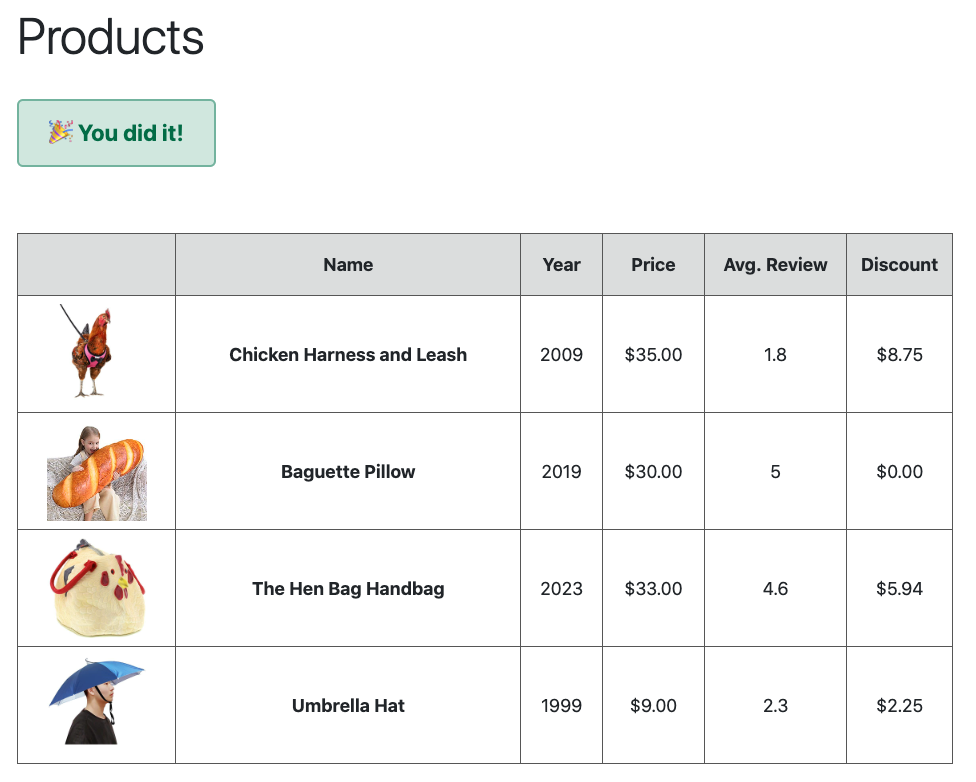

# JavaScript Rascal

Use template!

## Objectives

- Practice Read and Write skills
- Practice debugging skills
    - Reading and understanding error messages
    - Tracing code
    - Expectations vs Result

## Instructions

JaRa, The JavaScript Rascal, has struck the company headquarters. Per her calling card, she has only done damage to the company headquarters' `script.js` file, so only make changes to that file. She couldn't help herself, and has left some punny hints behind.

It will be your job to identify and fix the bugs. When all bugs are fixed, you should see this **exact data** on the page:

----

Use the troubleshooting and debugging skills you learned in class:

**Describe**

> What do you want to happen? 
> What is actually happening?

**Isolate**

> Where is the problem happening? 
> Which function? Which line of code?
> Use tools: `console.log()`, Chrome debugger

**Fix**

> Change one thing at a time!
> New bugs might mean you fixed the current bug
> Ask google, ask you peers
